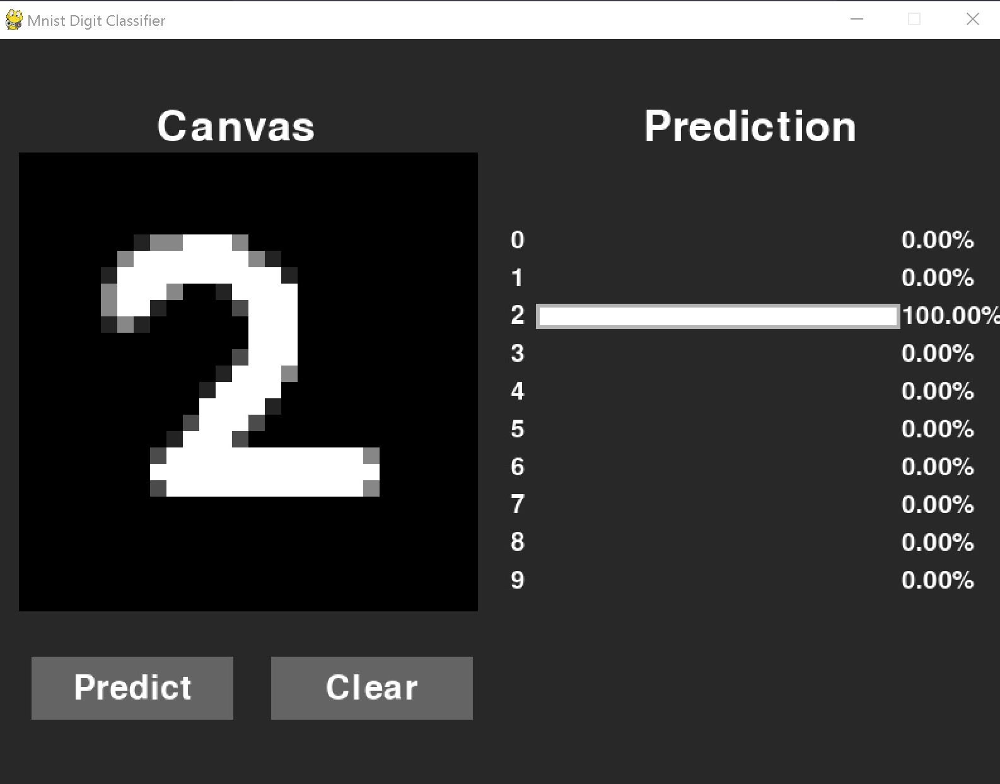

# **_Mnist_Digit_Classifier_**

Simple project to classify digits using model trained on MNIST dataset.

---

## To use the project, the following dependencies are to be installed:

- python=='3.11'
- tensorflow=='2.16.1'
- pygame=='2.5.2'

---

# How to run

after cloning the repo, follow the given steps:

1. clone this repository.
2. install the dependencies from `requirements.txt` on your system (preferably a virtual environment).
3. after setup is done, run the `main.py` file.

---

# To change the model used

1. load the model to use.
2. navigate to `model_.py` file.
3. replace the model name in the `keras.models.load_model()` method.

---

### _App image_

